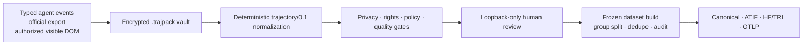

<p align="right">
  <strong>🌐 Language / 语言：</strong>
  <a href="./README.md"><strong>🇬🇧 English</strong></a> ·
  <a href="./README.zh-CN.md">🇨🇳 简体中文</a>
</p>

<p align="center">
  
</p>

<p align="center">
  <a href="https://github.com/undefinted/trajpack/actions/workflows/ci.yml"></a>
  <a href="LICENSE"></a>
  
  
  
  
</p>

<p align="center">
  <strong>Turn observable agent activity into reviewable, rights-aware research datasets.</strong><br>
  Local encrypted capture · deterministic normalization · human approval · reproducible export
</p>

> [!IMPORTANT]
> **trajpack is an observable-trajectory ETL and compliance router—not a hidden Chain-of-Thought extractor.** It stores only events, messages, tool activity, and reasoning representations exposed by the source interface. Opaque reasoning is classified explicitly and excluded from training views.

`trajpack` is an Apache-2.0, local-first TypeScript workspace for researchers who need auditable post-training data from agent runs. Raw provider events enter an encrypted vault; privacy, rights, policy, quality, and human-review gates stand between that vault and every plaintext training export. Training itself is deliberately out of scope.

> **Status:** v0.1 research preview. The repository is source-first and does not currently claim a public package-registry release. Adapter interfaces are pinned and fail closed when their expected format changes.

## Why trajpack

- **DeepSeek Harness-first, adapter-open.** The pinned Harness plugin treats its typed, append-only durable event log as the primary research surface, while the canonical schema remains provider-neutral.
- **Preserves trajectories, not just answers.** Messages, parallel tool calls, results, patches, approvals, failures, retries, compaction, verification, and subagent edges remain linked.
- **Separates evidence from training views.** Append-only raw envelopes remain encrypted; normalized and dataset views are deterministic, versioned derivatives.
- **Makes policy executable.** Archive, capture, noncompetitive training, competitive distillation, and redistribution are five independent decisions.
- **Builds research-ready outputs.** Canonical, ATIF v1.7, HF/TRL JSONL + native nested Parquet, and OTLP-oriented exports include lineage and integrity reports.
- **Fails closed.** Unknown rights, stale terms, ambiguous source identity, selector drift, incomplete quality checks, or missing approval block the relevant operation.

## Compatibility: what works today

“Adapter exists” and “this trace may be used for training” are separate claims. Every route below still passes the policy and review gates.

| Surface | Current route | Status | Important boundary |
| --- | --- | :---: | --- |
| **[Codex CLI](https://learn.chatgpt.com/docs/non-interactive-mode)** | `trajpack capture codex -- codex exec ...`; official `--json` is enforced | ✅ Native | JSON events are consumed without echoing plaintext to stdout. |
| **Codex interactive / rich client** | One-shot `arm` + plugin hooks; pinned App Server v2 records can be mapped offline | 🟡 Constrained | v0.1 does not start or proxy App Server stdio, and never parses unstable local transcripts. |
| **[Claude Code headless](https://code.claude.com/docs/en/headless)** | Wrapper enforces `--print --output-format stream-json --verbose` | ✅ Native | Visible thinking is a provider summary or opaque state, never asserted to be raw CoT. |
| **Claude Code interactive** | One-shot `arm` + lifecycle/tool/subagent hooks | 🟡 Constrained | An authenticated transcript may be retained only as an encrypted opaque artifact; its private JSONL schema is not parsed. |
| **[Gemini CLI](https://github.com/google-gemini/gemini-cli/blob/main/docs/hooks/reference.md)** | Plugin using the documented hook surface through `capture gemini` or one-shot `arm gemini` | ✅ Native hooks | Pinned to `gemini-cli-hook/1`; only observable hook payloads are retained, with no hidden-thinking claim. |
| **[DeepSeek Harness](https://github.com/deepseek-ai/deepseek-harness)** | Native typed `session/event` plugin for DeepSeek AI's official Developer Preview | ✅ Native preview (A−) | Pinned and fixture-tested against Harness `0.1.0-rc.6`; exact request-epoch SFT is available, while gaps, resumed partial context, conflicting duplicates, route conflicts, and unknown interfaces fail closed. |
| **Saved Harness session** | Official unpacked session JSONL via `--source-hint dsh-session` | ✅ Import (B) | Accepts only uncompressed, unpacked persistence v0. The artifact is marked `user_supplied`; packed rows and zstd input are refused. |
| **Saved DeepSeek API response** | Offline JSON/streaming-JSONL import | ✅ Import | Shape validation is not provider authentication; imported artifacts remain user-supplied until separately evidenced. |
| **ChatGPT web** | User-downloaded official ZIP/JSON/HTML export | 🟡 Archive/import | No live-page selector, network interception, cookie access, or automatic web capture. |
| **Claude web** | User-downloaded official `conversations.json`/ZIP export | 🟡 Archive/import | No live-page selector or automatic web capture. |
| **DeepSeek web** | Generic user-created JSON/JSONL/HTML archive only | 🟡 Manual archive | No dedicated web-export adapter; the commercial origin is blocked in the DOM extension. |
| **Gemini web** | [Google Takeout](https://support.google.com/gemini/answer/16920332?hl=en) “My Activity → Gemini Apps” JSON/HTML/ZIP import | 🟡 Official export snapshot | Fidelity B: a flat activity snapshot, not a reconstructed full-turn conversation. HTML stays inert; Gemini/Bard DOM origins are blocked. |
| **A site you own or are explicitly authorized to collect** | Click-driven Chromium MV3 extension + versioned selector recipe | 🧩 Authorized DOM | Visible accessible text only; preview and explicit approval are mandatory. No background capture or network interception. |

`A−` is an engineering support grade: a native typed surface exists, but the upstream product is still a Developer Preview and trajpack supports only the exact pinned contract. It is not a data-quality or legal-eligibility grade.

Commercial ChatGPT, Claude, DeepSeek, Gemini, and Bard origins have no bundled DOM recipes and are explicitly blocked by the generic extension. Use a provider's official export when a dedicated importer is listed above, or retain a conservative manual archive. Generic import and Takeout shape recognition do not establish provider authenticity or training rights.

The Gemini Takeout importer accepts `MyActivity.json` arrays whose records have a parseable `time`, a `products` entry equal to `Gemini Apps`, and at least one of `title`, `description`, or `header`. It also recognizes the usual `Takeout/My Activity/Gemini Apps/MyActivity.json` ZIP path and a conservatively marked `MyActivity.html`; HTML is retained as inert text and is never executed.

See [adapter details](docs/adapters.md) and the [Chromium extension boundaries](extensions/chromium/README.md).

## Five-minute start: archive and inspect

Prerequisites: [Node.js 24+](https://nodejs.org/) and pnpm 11.19.0. The commands below run from a source checkout.

```bash
git clone https://github.com/undefinted/trajpack.git
cd trajpack
pnpm install --frozen-lockfile
pnpm build
pnpm trajpack doctor
pnpm trajpack --help
```

Before importing a commercial-provider export, download the terms that apply to your region and account, retain them with your research records, and create a local snapshot. The tool hashes the file; it does not download or interpret legal text.

```bash
pnpm trajpack policy snapshot \
  --name "applicable provider terms" \
  --url "<exact-authority-url>" \
  --effective-at "<ISO-8601-time>" \
  --review-after "<ISO-8601-time>" \
  --input ./evidence/provider-terms.html \
  --output ./evidence/provider-terms.snapshot.json
```

Then import an export you downloaded yourself. This ChatGPT example creates an encrypted local archive and prompts for a passphrase of at least 12 characters:

```bash
pnpm trajpack import ./exports/chatgpt-export.zip \
  --source-hint chatgpt \
  --provider openai \
  --account-type consumer \
  --terms ./evidence/provider-terms.snapshot.json

pnpm trajpack review
pnpm trajpack policy explain <trace-id>
```

Use the authority URL and account class that actually apply to you. A successful archive import is **not** a training approval. For non-interactive test environments, `TRAJPACK_PASSPHRASE` is supported; avoid placing it in shell history or source control.

## Native agent capture

Integration bundles live in the repository and are built by `pnpm build`:

| Host | Integration entry | Wrapper |
| --- | --- | --- |
| Codex | [`plugins/trajpack`](plugins/trajpack) | `pnpm trajpack capture codex -- <codex command>` |
| Claude Code | [`plugins/claude-code`](plugins/claude-code) | `pnpm trajpack capture claude -- <claude command>` |
| Gemini CLI | [`plugins/trajpack-gemini`](plugins/trajpack-gemini) | `pnpm trajpack capture gemini -- <gemini command>` |
| DeepSeek Harness | [`plugins/deepseek-harness`](plugins/deepseek-harness) | `pnpm trajpack capture dsh -- <dsh command>` |
| Authorized Chromium | [`extensions/chromium`](extensions/chromium) → `build/` | Pair from `pnpm trajpack review` |

Install/register each bundle through the host's documented local-plugin mechanism. The forwarders are silent unless a wrapper capability or an unexpired same-directory one-shot arm exists:

```bash
pnpm trajpack arm codex --next-session --cwd <absolute-path> --ttl 10m [source and rights options]
pnpm trajpack arm claude --next-session --cwd <absolute-path> --ttl 10m [source and rights options]
pnpm trajpack arm gemini --next-session --cwd <absolute-path> --ttl 10m [source and rights options]
```

Run `pnpm trajpack doctor` (or `doctor --json`) to probe host executables and report the expected plugin directories, pinned interfaces, and safe web-import routes before collecting real data. It deliberately reports plugin installation as `not_verified`; confirm installation with each host's own list/validate command.

Capture is intentionally blocked until source, account, current terms or scoped permission, consent, and required rights metadata satisfy the `automatic_capture` gate. The most direct distillation research path is a legitimately licensed self-hosted model running through the pinned DeepSeek Harness, with the actual model artifact hashed locally and a retained runtime-binding receipt.

### DeepSeek Harness-first path

Harness is the lead integration because its typed, append-only durable event surface can preserve `request/header`, turns, reasoning/text chunks, native tool calls/results, compaction, retries, approvals, and subagent activity without scraping a UI. The `0.1.0-rc.6` plugin records the live-session boundary, validates strictly contiguous source sequence numbers, treats only byte-identical duplicates as idempotent, reconciles the observed provider/model route, and drains per-session delivery queues on flush/disposal. Raw payloads enter the encrypted vault; no plaintext fallback spool is created.

If a live plugin was not installed for an earlier run, import an official **unpacked and uncompressed** Harness persistence log explicitly:

```bash
pnpm trajpack import ./sessions/session.jsonl \
  --source-hint dsh-session \
  --provider <actual-model-provider> \
  --account-type <account-class> \
  --terms ./evidence/provider-terms.snapshot.json
```

This is a fidelity-B, `user_supplied` route: shape and sequence validation do not authenticate who produced the file. Packed persistence rows, zstd-compressed files, version drift, and sequence gaps fail closed. See the [DeepSeek Harness research path](docs/deepseek-research.md) and the complete [research workflow](docs/research-workflow.md).

## Research dataset workflow



The reproducible order is:

```text
capture/import → policy explain → evidence-backed override when required
→ review and approve → dataset plan → export → validate → train/evaluate elsewhere
```

For an approved single trace, a versioned HF/TRL recipe can derive a narrowly scoped training view without changing the encrypted evidence layer:

```bash
pnpm trajpack export <trace-id> \
  --format hf-trl \
  --recipe deepseek_epoch_sft \
  --mode training_competitive_distillation \
  --output ./exports/dsh-exact-epoch-study \
  --plaintext
```

The seven recipes are `answer_sft`, `reasoning_sft`, `tool_use_sft`, `deepseek_epoch_sft`, `failure_recovery`, `subagent_handoff`, and `pointwise_reward_rl_ready`. For a complete pinned Harness trace, `deepseek_epoch_sft` is the highest-fidelity path: it replays the rc.6 raw durable log into request epochs and requires the provider/model route, request header, system prompt, native tools, compaction-aware model-visible surface, and completed output to align exactly with review-included, privacy-passed canonical projections. `reasoning_sft` accepts only complete `provider_exposed_reasoning`; summaries, opaque states, unavailable reasoning, and partial-only streams are excluded. `pointwise_reward_rl_ready` emits verified scalar-reward evidence with versioned verifier provenance and reviewer confirmation for downstream reward-model/RL research—it does not fabricate a chosen/rejected DPO pair, a step reward, or a success label. Recipe export is single-trace in v0.1. Frozen multi-trace builds use the audited `trace_full` view only for sources whose topology can be represented unambiguously; DeepSeek Harness HF/TRL export requires an explicit versioned recipe and intentionally rejects `trace_full`.

Cross-adapter recipes deliberately do not guess Harness context. On a Harness trace, a resumed session with `firstLiveSeq > 0` blocks every training recipe; recapture or import a complete sequence-zero log. A prior `surfaceOp: replace` blocks the generic target recipe and directs a complete trace to `deepseek_epoch_sft`, whose epoch replay applies the replacement. Missing `request/header`, provider/model mismatch, raw/canonical drift, or an unreconstructable epoch also fail closed.

For a multi-trace research build, define private repository/task-family aliases, freeze the reviewed inputs, export to a new plaintext directory, and validate it:

```bash
pnpm trajpack dataset plan <trace-id> <trace-id> \
  --name paper-ablation-1 \
  --mode training_competitive_distillation \
  --target-model-owner my-lab \
  --target-product student-v1 \
  --seed paper-ablation-1 \
  --group-map ./private-groups.json \
  --quality-profile research_strict \
  --output ./paper-ablation-1.build.json

pnpm trajpack export ./paper-ablation-1.build.json \
  --format hf-trl \
  --output ./exports/paper-ablation-1 \
  --plaintext

pnpm trajpack validate ./exports/paper-ablation-1
```

`dataset plan` stores HMAC identifiers rather than private group aliases. `research_strict` checks lineage groups, exact and bounded token-shingle near-duplicates, topology, tool-call/result pairing, quality evidence, and split contamination. The build freezes source, decision, approval, compiler, target, quality, and split-policy versions.

### Export targets

| Format | Intended use | Output notes |
| --- | --- | --- |
| `canonical` | Lossless research archive and reprocessing | Manifest, JSONL events, content-addressed blobs, checksums, and provenance. |
| `atif` | Agent trajectory interchange | ATIF v1.7 with observable reasoning, calls/observations, reward/verifier data when genuinely present, and topology sidecars. |
| `hf-trl` | SFT/evaluation pipelines | Conversational JSONL plus native nested Parquet, tool schema/calls, training targets, and message-level loss-mask audit metadata. |
| `otlp` | Trace viewers and evaluation interoperability | Resource spans using the project's pinned development mapping, with content digests by default. |

Every dataset export also carries a dataset card, source/model/authenticity and quality statistics, policy version, rights/license summary, redaction report, deduplication audit, lineage, checksums, and a `COMPLETE` marker. Exported data does **not** inherit the repository's Apache-2.0 license.

### Content-free workload analytics

```bash
pnpm trajpack analyze <trace-id> [<trace-id> ...] --format summary
pnpm trajpack analyze <trace-id> [<trace-id> ...] --format tracelab-jsonl
```

`analyze` derives deterministic workload and training-yield metrics from approved managed traces. The `tracelab-jsonl` projection is intentionally content-free and lossy: it is useful for systems-style workload analysis, but it never replaces the encrypted canonical trajectory or becomes a training source.

[TraceLab](https://github.com/uw-syfi/TraceLab) is an analytics inspiration, not a runtime dependency. TraceLab focuses on studying agent-serving workloads; trajpack focuses on governed, reviewable transformation from observable evidence into versioned SFT or verifier-backed pointwise-RL views. Canonical content, rights, redactions, topology, and lineage remain under trajpack governance, while the TraceLab-shaped projection contains aggregate/digest-level workload fields only.

### Load with Hugging Face Datasets and TRL

```python
from datasets import load_dataset

dataset = load_dataset(
    "parquet",
    data_files={
        "train": "exports/paper-ablation-1/splits/train/dataset.parquet",
        "validation": "exports/paper-ablation-1/splits/validation/dataset.parquet",
        "test": "exports/paper-ablation-1/splits/test/dataset.parquet",
    },
)
```

The JSONL representation follows TRL's conversational/tool schema. The current `assistant_loss_mask` is message-level audit metadata, **not** a token mask. Enable TRL `assistant_only_loss=True` only after verifying that the selected chat template emits the required generation markers. See [the tested loading examples and reproducibility checklist](docs/research-workflow.md#6-load-hf-datasets-and-trl).

## Security and policy gates

The following decisions are independent and stored as `allow | deny | unknown`:

```text
local_archive
automatic_capture
training_noncompetitive
training_competitive_distillation
redistribution
```

`unknown` blocks. Training export additionally requires known per-content rights, current non-conflicting terms or scoped evidence, target/use scope, privacy and quality checks, active consent, source-provenance review, and final human approval. Overrides are trace-, dimension-, target-, evidence-, reviewer-, and expiry-scoped; there is no global bypass.

Security defaults include:

- Argon2id + libsodium XChaCha20-Poly1305 secretstream encrypted vaults; no plaintext fallback spool.
- Loopback-only reviewer with one-time launch/pairing nonces, strict Origin/Host/CSRF checks, CSP, and inert text rendering.
- Bounded and fail-closed JSON, vault, ZIP, collector, stdout-line, and dataset inputs.
- Explicit plaintext export into a new directory via staged checksums and an atomic publish marker.
- Zero default telemetry, zero cloud dependency, and no OS-keychain persistence in v0.1.
- Tombstones for managed deletion; external plaintext copies cannot be recalled.

Read the [security model](docs/security.md), [policy semantics](docs/policy.md), and [v0.1 security audit](docs/security-audit-2026-08-16.md). The policy registry is an engineering hard gate, not legal advice.

## CLI map

```text
trajpack capture codex -- <codex command>
trajpack capture claude -- <claude command>
trajpack capture gemini -- <gemini command>
trajpack capture dsh -- <dsh command>
trajpack arm <codex|claude|gemini> --next-session --cwd <path> --ttl 10m
trajpack import <official-export-or-trajpack>
trajpack review
trajpack doctor [--json]
trajpack analyze <trace-ids...> --format summary|tracelab-jsonl
trajpack validate <trace-or-dataset>
trajpack dataset plan <trace-ids...> --output <build.json> ...
trajpack policy explain <trace>
trajpack policy snapshot ...
trajpack policy override <trace> ...
trajpack export <selection> --format canonical|atif|hf-trl|otlp [--recipe <versioned-recipe>]
trajpack delete <trace-id> --yes
```

Run `pnpm trajpack <command> --help` for the exact required options. Unknown source metadata and unsupported formats fail closed.

## Known limits

- No hidden reasoning recovery, browser network capture, token/cookie access, or commercial-site DOM preset.
- Gemini Takeout import is a fidelity-B flat activity snapshot; it does not manufacture missing turns, tool edges, or chronology.
- The current Gemini CLI hook surface may lack a provider tool-call ID; trajpack records a deterministic synthetic pairing key, so identical concurrent calls are a documented fidelity limit.
- Codex App Server support is an offline pinned mapper, not a live App Server proxy.
- The official DeepSeek AI Harness is a Developer Preview; trajpack pins `0.1.0-rc.6` rather than assuming upstream format stability.
- Harness persistence import currently accepts only unpacked, uncompressed v0 JSONL. Packed/chunked rows and zstd-compressed persistence fail closed; use native plugin capture or produce an explicitly unpacked artifact.
- Generic Harness training recipes block resumed partial context and targets after a surface replacement instead of guessing the teacher-visible prefix. Use a complete sequence-zero trace with `deepseek_epoch_sft` for exact compaction-aware request reconstruction.
- No recipe recovers hidden CoT. `reasoning_sft` requires complete provider-exposed reasoning, and `pointwise_reward_rl_ready` is verified scalar-reward evidence for downstream reward-model/RL research rather than a DPO preference pair or an RL trainer.
- A local collector capability authenticates the capture process tree, not the provider or an adversarial tool subprocess.
- Offline response shape, a local model hash, reviewer identity, and exported checksums are evidence—not vendor signatures or proof of current authorization.
- Secret/PII scanning is conservative pattern matching, not proof of anonymization or license cleanliness.
- Dataset compilation is bounded in-process at a conservative 256 MiB decrypted-object estimate; near-deduplication is token-shingle Jaccard, not embedding-level semantic deduplication.
- Training execution, tokenizer-aware packing, DPO-pair fabrication, RL, and synthetic success labels are out of scope.

## Roadmap

- Additional versioned official-export adapters, plus richer Gemini export fidelity if Google publishes a stable conversation-level format.
- Live but still pinned App Server integration with explicit local transport boundaries.
- Streaming compilation for larger corpora and optional semantic-deduplication reports.
- Signed lab attestations, trusted provider receipt verifiers, and reproducible environment manifests.
- Cross-platform plugin installers, Firefox support, and richer reviewer comparison/ablation views.

Roadmap items are not current compatibility promises. Contributions should preserve the local-first, explicit-consent, observable-only, and fail-closed boundaries.

## Development and verification

```bash
pnpm install --frozen-lockfile
pnpm build
pnpm typecheck
pnpm test
pnpm audit --prod
pnpm audit:static
pnpm test:pack
pnpm --filter @trajpack/chromium-extension test:e2e
```

The CI matrix covers Windows, macOS, and Linux; Chromium end-to-end tests target Chrome and Edge. See [architecture](docs/architecture.md), [format mappings](docs/formats.md), [release verification](docs/release.md), and [design references](docs/references.md).

## License and responsible use

Code is licensed under [Apache-2.0](LICENSE). Dataset licensing is generated independently for each export. Only collect data you own or are authorized to process, and verify the applicable provider terms, account/contract, jurisdiction, model license, repository/tool-output rights, participant consent, and target use.
