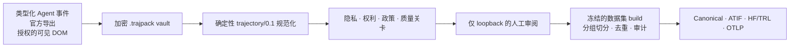

<p align="center">
  
</p>

<p align="center">
  <a href="README.md">English</a> · <a href="README.zh-CN.md"><strong>简体中文</strong></a>
</p>

<p align="center">
  <a href="https://github.com/undefinted/trajpack/actions/workflows/ci.yml"></a>
  <a href="LICENSE"></a>
  
  
  
  
</p>

<p align="center">
  <strong>把可观察的 Agent 活动转化为可审阅、权利清晰的科研数据集。</strong><br>
  本地加密采集 · 确定性规范化 · 人工批准 · 可复现导出
</p>

> [!IMPORTANT]
> **trajpack 是“可观察轨迹 ETL + 合规路由器”，不是隐藏 Chain-of-Thought 提取器。** 它只保存来源接口明确暴露的事件、消息、工具活动和推理表示。不可见或不透明的推理会被明确分类，并排除在训练视图之外。

`trajpack` 是一个采用 Apache-2.0、local-first、全 TypeScript 的科研工作区，用于从 Agent 运行中构建可审计的后训练数据。原始提供商事件首先进入加密 vault；任何明文训练导出之前，都必须经过隐私、权利、政策、质量与人工审阅关卡。项目有意不包含训练执行器。

> **项目状态：** v0.1 科研预览版。目前以源码工作区为主要交付方式，不宣称已在公共包注册表正式发布。适配器接口均固定版本，格式发生未知变化时会 fail closed。

## 为什么使用 trajpack

- **保留完整轨迹，而不只是最终答案。** 消息、并行工具调用、结果、patch、审批、失败、重试、compaction、验证和子 Agent 边都会保持关联。
- **把证据层与训练视图分开。** Append-only 原始 envelope 保持加密；规范化视图和数据集视图都是确定性、版本化的派生结果。
- **将政策变成可执行关卡。** 本地归档、自动采集、非竞争训练、竞争性蒸馏和再分发是五个相互独立的决定。
- **生成科研可用的结果。** Canonical、ATIF v1.7、HF/TRL JSONL + 原生嵌套 Parquet 以及面向 OTLP 的导出均附带 lineage 与完整性报告。
- **默认保守阻断。** 权利未知、条款过期、来源身份含糊、selector 漂移、质量检查不完整或缺少批准时，相关操作会被阻断。

## 兼容性：当前真正可用的能力

“存在适配器”和“该 trace 可用于训练”是两个独立判断。下表中的每条路径仍然必须通过政策与人工审阅关卡。

| 使用界面 | 当前路径 | 状态 | 重要边界 |
| --- | --- | :---: | --- |
| **[Codex CLI](https://learn.chatgpt.com/docs/non-interactive-mode)** | `trajpack capture codex -- codex exec ...`；强制使用官方 `--json` | ✅ 原生 | JSON 事件会被消费，但不会将明文回显到 stdout。 |
| **Codex 交互式/富客户端** | 一次性 `arm` + 插件 hooks；可离线映射固定版本的 App Server v2 记录 | 🟡 受限 | v0.1 不启动或代理 App Server stdio，也不解析不稳定的本地 transcript。 |
| **[Claude Code headless](https://code.claude.com/docs/en/headless)** | 包装器强制加入 `--print --output-format stream-json --verbose` | ✅ 原生 | 可见 thinking 只会分类为 provider summary 或 opaque state，不会声称是原始 CoT。 |
| **Claude Code 交互会话** | 一次性 `arm` + 生命周期、工具和子 Agent hooks | 🟡 受限 | 通过绑定验证的 transcript 只能作为加密 opaque artifact 保存；不解析其私有 JSONL schema。 |
| **[Gemini CLI](https://github.com/google-gemini/gemini-cli/blob/main/docs/hooks/reference.md)** | 通过 `capture gemini` 或一次性 `arm gemini` 接入基于官方文档化 hook 的插件 | ✅ 原生 hooks | 固定接口为 `gemini-cli-hook/1`；只保留可观察 hook payload，不声称恢复隐藏 thinking。 |
| **[DeepSeek Harness](https://github.com/deepseek-ai/deepseek-harness)** | 面向 DeepSeek AI 官方 Developer Preview 的原生 `session/event` 插件 | ✅ 原生预览（A−） | 仅对 Harness `0.1.0-rc.6` 做过 fixture 测试；未知 persistence 版本会被拒绝。 |
| **已保存的 DeepSeek API 响应** | 离线导入 JSON/流式 JSONL | ✅ 导入 | 结构验证不等于提供商认证；在单独提供证据前，导入内容仍属于 user-supplied。 |
| **ChatGPT 网页版** | 用户主动下载的官方 ZIP/JSON/HTML 导出 | 🟡 归档/导入 | 没有实时网页 selector、网络拦截、cookie 访问或自动网页采集。 |
| **Claude 网页版** | 用户主动下载的官方 `conversations.json`/ZIP 导出 | 🟡 归档/导入 | 没有实时网页 selector 或自动网页采集。 |
| **DeepSeek 网页版** | 仅支持用户生成的通用 JSON/JSONL/HTML 手动归档 | 🟡 手动归档 | 没有专用网页导出适配器；Chromium 扩展会阻止该商业站点。 |
| **Gemini 网页版** | 导入 [Google Takeout](https://support.google.com/gemini/answer/16920332?hl=zh-CN)“我的活动 → Gemini Apps”的 JSON/HTML/ZIP | 🟡 官方导出快照 | B 级 fidelity：扁平活动快照，不会重建完整多轮对话。HTML 保持惰性文本；Gemini/Bard DOM 站点仍被阻止。 |
| **你拥有或获得明确采集授权的网站** | 点击触发的 Chromium MV3 扩展 + 版本化 selector recipe | 🧩 授权 DOM | 只读取可见、可访问文本；必须预览并明确批准。没有后台采集或网络拦截。 |

`A−` 是工程支持等级：存在原生类型化事件面，但上游产品仍处于 Developer Preview，trajpack 只支持精确固定的接口契约。它不代表数据质量等级或法律许可等级。

商业 ChatGPT、Claude、DeepSeek、Gemini 和 Bard 站点没有内置 DOM recipe，并被通用扩展明确阻止。若上表列出了专用导入器，请使用提供商的官方导出；否则只能保守保存手动归档。通用导入与 Takeout 结构识别都不会自动证明提供商真实性或训练权利。

Gemini Takeout 导入器接受 `MyActivity.json` 数组：每条记录必须包含可解析的 `time`、值为 `Gemini Apps` 的 `products` 项，并至少包含 `title`、`description` 或 `header` 之一。它也识别常见的 `Takeout/My Activity/Gemini Apps/MyActivity.json` ZIP 路径及带保守标记的 `MyActivity.html`；HTML 始终作为惰性文本保存，绝不会执行。

详见[适配器说明](docs/adapters.md)和[Chromium 扩展边界](extensions/chromium/README.md)。

## 五分钟入门：归档并检查数据

前置条件：[Node.js 24+](https://nodejs.org/) 和 pnpm 11.19.0。以下命令在源码仓库中运行。

```bash
git clone https://github.com/undefinted/trajpack.git
cd trajpack
pnpm install --frozen-lockfile
pnpm build
pnpm trajpack doctor
pnpm trajpack --help
```

导入商业提供商的官方导出前，应先下载适用于你的地区和账号的条款，将其纳入科研证据留存，然后建立本地快照。工具只负责对文件取哈希，不会自行下载或解释法律文本。

```bash
pnpm trajpack policy snapshot \
  --name "applicable provider terms" \
  --url "<exact-authority-url>" \
  --effective-at "<ISO-8601-time>" \
  --review-after "<ISO-8601-time>" \
  --input ./evidence/provider-terms.html \
  --output ./evidence/provider-terms.snapshot.json
```

随后导入你自己主动下载的官方数据。下面的 ChatGPT 示例会创建本地加密归档，并提示输入至少 12 个字符的口令：

```bash
pnpm trajpack import ./exports/chatgpt-export.zip \
  --source-hint chatgpt \
  --provider openai \
  --account-type consumer \
  --terms ./evidence/provider-terms.snapshot.json

pnpm trajpack review
pnpm trajpack policy explain <trace-id>
```

请使用真正适用于你的 authority URL 和账号类别。归档导入成功**不等于**获得训练批准。非交互测试环境可使用 `TRAJPACK_PASSPHRASE`，但不要把它写进 shell 历史或源码仓库。

## 原生 Agent 采集

集成包位于仓库下列目录，并会由 `pnpm build` 一并构建：

| Host | 集成入口 | 包装命令 |
| --- | --- | --- |
| Codex | [`plugins/trajpack`](plugins/trajpack) | `pnpm trajpack capture codex -- <codex command>` |
| Claude Code | [`plugins/claude-code`](plugins/claude-code) | `pnpm trajpack capture claude -- <claude command>` |
| Gemini CLI | [`plugins/trajpack-gemini`](plugins/trajpack-gemini) | `pnpm trajpack capture gemini -- <gemini command>` |
| DeepSeek Harness | [`plugins/deepseek-harness`](plugins/deepseek-harness) | `pnpm trajpack capture dsh -- <dsh command>` |
| 授权 Chromium | [`extensions/chromium`](extensions/chromium) → `build/` | 从 `pnpm trajpack review` 进行配对 |

请通过各宿主官方说明的本地插件机制安装或注册对应目录。除非存在包装器 capability 或同目录、尚未过期的一次性 arm，forwarder 会保持静默：

```bash
pnpm trajpack arm codex --next-session --cwd <absolute-path> --ttl 10m [source and rights options]
pnpm trajpack arm claude --next-session --cwd <absolute-path> --ttl 10m [source and rights options]
pnpm trajpack arm gemini --next-session --cwd <absolute-path> --ttl 10m [source and rights options]
```

采集真实数据前，运行 `pnpm trajpack doctor`（或 `doctor --json`）可以探测宿主可执行文件，并报告预期插件目录、固定接口和安全网页导入路径。它会刻意把插件安装状态报告为 `not_verified`；请再使用各宿主自己的 list/validate 命令确认安装。

在来源、账号、当前条款或限定范围的许可、同意记录和必要的权利元数据满足 `automatic_capture` gate 之前，采集会被主动阻断。当前最直接的蒸馏科研路径，是在固定版本的 DeepSeek Harness 中运行来源合法的自托管模型：由 trajpack 本地计算真实模型 artifact 哈希，并保留运行时绑定 receipt。完整步骤见[科研工作流](docs/research-workflow.md)。

## 科研数据集工作流



可复现的执行顺序是：

```text
capture/import → policy explain → 必要时执行基于证据的 override
→ review 并批准 → dataset plan → export → validate → 在外部训练/评测
```

构建多 trace 科研数据集时，需要定义私有的仓库/任务族别名，冻结已经审阅的输入，导出到新的明文目录并完成验证：

```bash
pnpm trajpack dataset plan <trace-id> <trace-id> \
  --name paper-ablation-1 \
  --mode training_competitive_distillation \
  --target-model-owner my-lab \
  --target-product student-v1 \
  --seed paper-ablation-1 \
  --group-map ./private-groups.json \
  --quality-profile research_strict \
  --output ./paper-ablation-1.build.json

pnpm trajpack export ./paper-ablation-1.build.json \
  --format hf-trl \
  --output ./exports/paper-ablation-1 \
  --plaintext

pnpm trajpack validate ./exports/paper-ablation-1
```

`dataset plan` 只保存 HMAC 标识符，不保存私有 group 别名。`research_strict` 会检查 lineage group、精确重复和有界 token-shingle 近似重复、拓扑、工具调用/结果配对、质量证据以及跨 split 污染。Build 会冻结来源、决定、批准、编译器、目标、质量和切分政策版本。

### 导出目标

| 格式 | 主要用途 | 输出说明 |
| --- | --- | --- |
| `canonical` | 无损科研归档与再处理 | Manifest、JSONL events、content-addressed blobs、checksums 和 provenance。 |
| `atif` | Agent 轨迹交换 | ATIF v1.7；保留可观察 reasoning、call/observation、真实存在的 reward/verifier 数据及拓扑 sidecar。 |
| `hf-trl` | SFT/评测流水线 | 对话 JSONL + 原生嵌套 Parquet、tool schema/call、training target 和消息级 loss-mask 审计元数据。 |
| `otlp` | Trace viewer 与评测系统互通 | 使用项目固定的开发版映射生成 resource spans，默认只携带内容摘要。 |

每次数据集导出还会附带 dataset card、来源/模型/真实性与质量统计、政策版本、权利/许可证摘要、redaction 报告、去重审计、lineage、checksums 和 `COMPLETE` 标记。导出的数据**不会**自动继承仓库的 Apache-2.0 许可证。

### 使用 Hugging Face Datasets 和 TRL 加载

```python
from datasets import load_dataset

dataset = load_dataset(
    "parquet",
    data_files={
        "train": "exports/paper-ablation-1/splits/train/dataset.parquet",
        "validation": "exports/paper-ablation-1/splits/validation/dataset.parquet",
        "test": "exports/paper-ablation-1/splits/test/dataset.parquet",
    },
)
```

JSONL 采用 TRL 的对话/tool schema。当前 `assistant_loss_mask` 是消息级审计元数据，**不是** token mask。只有确认所用 chat template 会产生所需 generation marker 后，才能开启 TRL 的 `assistant_only_loss=True`。详见[已测试的加载示例与复现清单](docs/research-workflow.md#6-load-hf-datasets-and-trl)。

## 安全与政策关卡

以下决定相互独立，状态分别为 `allow | deny | unknown`：

```text
local_archive
automatic_capture
training_noncompetitive
training_competitive_distillation
redistribution
```

`unknown` 会阻断操作。训练导出还要求：逐内容权利已知、条款当前有效且无冲突或具有限定范围的证据、目标和用途范围明确、隐私与质量检查通过、同意仍有效、来源 provenance 已审阅，并获得最终人工批准。Override 会绑定到 trace、判定维度、目标、证据、reviewer 和失效时间；不存在全局 bypass。

默认安全措施包括：

- 使用 Argon2id + libsodium XChaCha20-Poly1305 secretstream 加密 vault；不存在明文 fallback spool。
- Reviewer 只绑定 loopback，使用一次性启动/配对 nonce、严格 Origin/Host/CSRF 检查、CSP 和纯文本惰性渲染。
- JSON、vault、ZIP、collector、stdout 单行和数据集输入均有上限，超限或异常时 fail closed。
- 明文只能显式导出到新目录，并通过 staging checksums 和原子发布标记完成交付。
- v0.1 默认零遥测、零云依赖，不把密钥写入 OS keychain。
- 删除受管数据时保留 tombstone；已复制到外部的明文无法自动召回。

请阅读[安全模型](docs/security.md)、[政策语义](docs/policy.md)和 [v0.1 安全审计](docs/security-audit-2026-08-16.md)。政策 registry 是工程 hard gate，不是法律意见。

## CLI 命令一览

```text
trajpack capture codex -- <codex command>
trajpack capture claude -- <claude command>
trajpack capture gemini -- <gemini command>
trajpack capture dsh -- <dsh command>
trajpack arm <codex|claude|gemini> --next-session --cwd <path> --ttl 10m
trajpack import <official-export-or-trajpack>
trajpack review
trajpack doctor [--json]
trajpack validate <trace-or-dataset>
trajpack dataset plan <trace-ids...> --output <build.json> ...
trajpack policy explain <trace>
trajpack policy snapshot ...
trajpack policy override <trace> ...
trajpack export <selection> --format canonical|atif|hf-trl|otlp
trajpack delete <trace-id> --yes
```

运行 `pnpm trajpack <command> --help` 可查看准确的必需参数。来源元数据未知或格式不受支持时会 fail closed。

## 已知边界

- 不恢复隐藏推理，不拦截浏览器网络，不读取 token/cookie，也不提供商业站点 DOM preset。
- Gemini Takeout 导入只是 B 级扁平活动快照；不会编造缺失的 turn、工具边或时间关系。
- 当前 Gemini CLI hook 可能不提供厂商 tool-call ID；trajpack 会记录确定性合成配对键，因此完全相同的并发调用属于已知 fidelity 边界。
- Codex App Server 支持属于离线固定版本 mapper，不是实时 App Server proxy。
- DeepSeek Harness 是 DeepSeek AI 官方 Developer Preview；trajpack 固定支持 `0.1.0-rc.6`，不会假设上游格式已经稳定。
- 本地 collector capability 只能认证采集进程树，不能认证提供商或对抗恶意工具子进程。
- 离线响应结构、本地模型哈希、reviewer 身份和导出 checksum 都只是证据，不是厂商签名或当前授权证明。
- Secret/PII 扫描是保守的模式匹配，无法证明数据已完全匿名或许可证完全干净。
- 数据集编译采用有界的 in-process 实现，解密对象保守估算上限为 256 MiB；近似去重采用 token-shingle Jaccard，不是 embedding 语义去重。
- 训练执行、tokenizer-aware packing、伪造 DPO pair、RL 和合成成功标签不在项目范围内。

## Roadmap

- 增加更多版本化官方导出适配器；若 Google 提供稳定的对话级格式，则提升 Gemini 导出 fidelity。
- 在保持显式本地传输边界的前提下，增加仍然固定版本的实时 App Server 集成。
- 为更大语料实现流式编译，并提供可选的语义去重报告。
- 增加签名式实验室证明、可信 provider receipt verifier 和可复现环境 manifest。
- 提供跨平台插件安装器、Firefox 支持以及更丰富的 reviewer 对比/消融视图。

Roadmap 不代表当前兼容性承诺。任何贡献都应保持 local-first、明确同意、仅采集可观察内容和 fail-closed 的边界。

## 开发与验证

```bash
pnpm install --frozen-lockfile
pnpm build
pnpm typecheck
pnpm test
pnpm audit --prod
pnpm audit:static
pnpm test:pack
pnpm --filter @trajpack/chromium-extension test:e2e
```

CI 矩阵覆盖 Windows、macOS 和 Linux；Chromium 端到端测试面向 Chrome 与 Edge。更多信息见[架构](docs/architecture.md)、[格式映射](docs/formats.md)、[发布验证](docs/release.md)和[设计参考](docs/references.md)。

## 许可证与负责任使用

代码采用 [Apache-2.0](LICENSE)。每次导出都会独立生成数据集许可信息。请只采集你拥有或被授权处理的数据，并逐项核实适用的提供商条款、账号/合同、司法辖区、模型许可证、仓库/工具输出权利、参与者同意以及目标用途。
