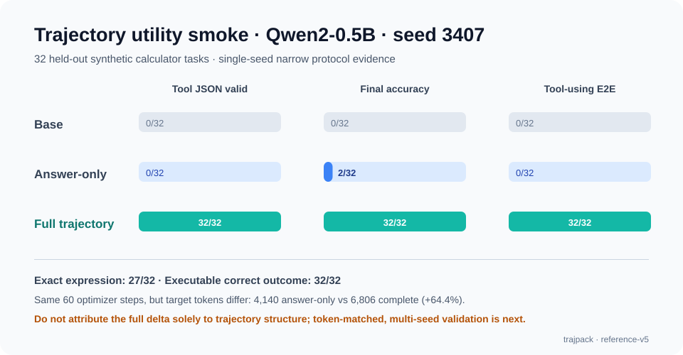

# Reference utility smoke result (v5)

This is a real local GPU run, not a projected or fabricated result. It is
evidence that the complete action → observation view was useful for this one
calculator protocol—not proof that trajectories are universally better.

| Arm | Tool JSON | Exact expression | Executable outcome | Final accuracy | Tool-using E2E |
| --- | ---: | ---: | ---: | ---: | ---: |
| Base | 0/32 | 0/32 | 0/32 | 0/32 | 0/32 |
| Answer-only SFT | 0/32 | 0/32 | 0/32 | 2/32 | 0/32 |
| Complete trajectory SFT | **32/32** | **27/32** | **32/32** | **32/32** | **32/32** |

All arms used Qwen2-0.5B-Instruct at revision
`c540970f9e29518b1d8f06ab8b24cba66ad77b6d` and seed `3407`. Both SFT arms
used 60 optimizer steps, but this is **not a target-token-matched comparison**:
answer-only exposed 4,140 target tokens while complete trajectory exposed 6,806
(+64.4%). The difference therefore cannot be causally assigned to trajectory
structure alone.

The complete arm's five non-exact expressions still executed to the correct
answer, which is why exact expression match is 27/32 while executable outcome is
32/32. Direct answers are counted fairly: answer-only solved 2/32 without a
tool, and those count toward final accuracy; only tool and E2E metrics require
the action → observation route.

## Reproducibility record

- Hardware: NVIDIA RTX 4060 Laptop GPU (8 GB), CUDA 12.1.
- Stack: Python 3.12.3, PyTorch 2.5.1+cu121, Transformers 4.46.3, PEFT 0.13.2.
- Deterministic algorithms and truly offline cached loading were enabled.
- Total arm wall time: 326.35 seconds.
- Peak allocated GPU memory: base 0.96 GiB, answer-only 1.53 GiB, complete 1.77 GiB.
- Dataset: 96 paired train tasks per SFT arm and 32 held-out tasks; all 224
  records passed trajpack's actual Zod `DatasetExample` schema.
- Full local result SHA-256:
  `3dffb3e5f4f6a010c9eed0d9ab2c9ef31a74085c48c9ff23112e6a54766c240e`.
- Executed source-tree SHA-256:
  `3ed6f0d14132e617d8bf44ef8e979c4002d4bf1a464ba0e48dc2c3142abcc2ce`.
- Config SHA-256:
  `466bfa032576d788d0d09022d2dc8b03be71fbeb8f4bb1311012d03c285a2006`.

The compact machine-readable record is
[`reference-v5.json`](reference-v5.json). Raw predictions, model cache, and LoRA
weights remain under `work/ignored` and are intentionally not committed.

## Important limits

- Single model revision, single seed, and one narrow synthetic domain.
- Held-out instances are disjoint, but use the same five template families.
- Target-token exposure differs by 64.4% between SFT arms.
- No claim about coding agents, RL, broad reasoning, hidden chain of thought, or
  provider signature recovery follows from this result.

The next experiment should be pre-registered before observing its outcomes:
multiple paired seeds plus a target-token-matched complete-trajectory control.

During development, an excluded v3 run exposed a real lifecycle bug: a temporary
dictionary retained the previous PEFT model and caused CUDA OOM in the next arm.
The runner now returns/destructures the model without that extra reference; the
reported v5 run completed with the fixed lifecycle. A separate guard also makes
`--local-files-only` cover PEFT's save-time lookup, not just Transformers model
loading.
